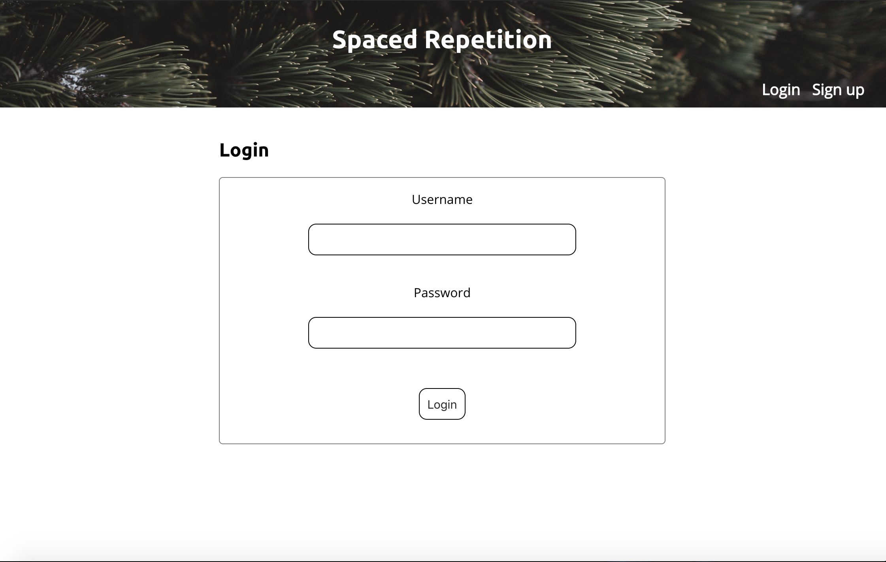
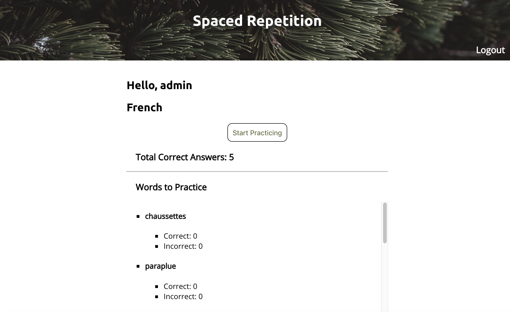
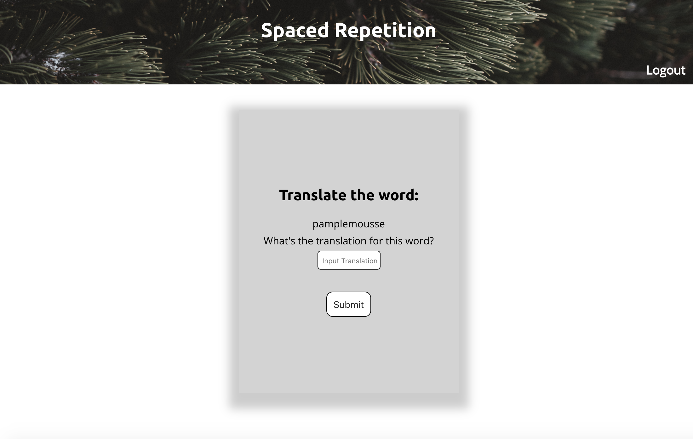
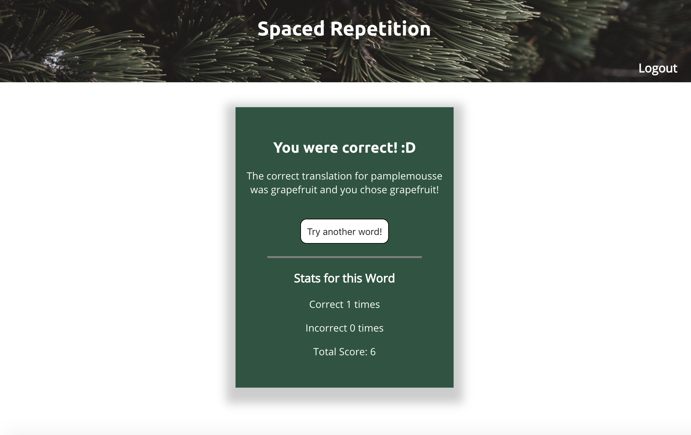

# Spaced Repetition Capstone Client
## Created By: Julio Hernandez & Shannon Lichtenwalter

### Links
See it Live: https://spaced-repetition-julio-shannon-client.now.sh/
Client Repo: https://github.com/thinkful-ei-heron/spaced-repetition-Julio-Shannon-client
Server Repo: https://github.com/thinkful-ei-heron/spaced-repetition-Julio-Shannon-server

### Introduction
This application is a platform for learning French through the technique of spaced repetition to help with memorization. With this application the user can create an account and login. They can see a dashboard to view their learning progress. The user is able to 'Start Practicing' where they will be given a French word that they must type in the translation for. The user will be notified if their answer is correct or incorrect. The user will see their updated scores. The user can then move on to practicing more words. Happy Learning!

### Try it out
You may register as a new user or try out our application with the following login information:

Login: admin Password: Password!1

### Technology Stack
The front-end client for this application was created using HTML, CSS, Javascript and React. It is deployed using Zeit. The front-end client is intended to interact with a server that is deployed via Heroku.

### Screenshots

##### Login Page
  

##### Dashboard Page
  

##### Learning Page
  

  ##### answer Page
  